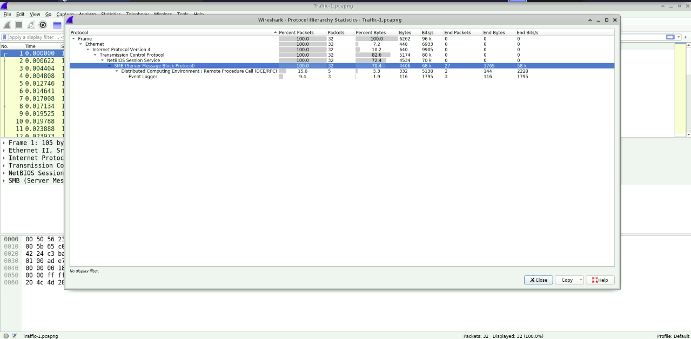
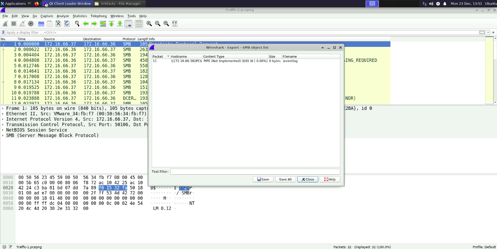
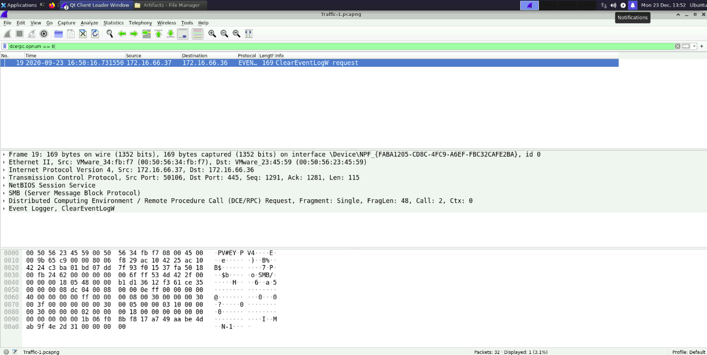
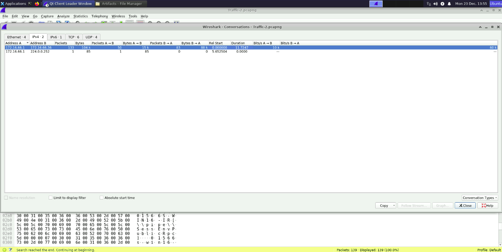

## [PacketDetective Lab](https://cyberdefenders.org/blueteam-ctf-challenges/packetdetective/)

### Description

`In September 2020, your SOC detected suspicious activity from a user device, flagged by unusual SMB protocol usage. Initial analysis indicates a possible compromise of a privileged account and remote access tool usage by an attacker.`

`Your task is to examine network traffic in the provided PCAP files to identify key indicators of compromise (IOCs) and gain insights into the attacker’s methods, persistence tactics, and goals. Construct a timeline to better understand the progression of the attack by addressing the following questions.`

**Category:** Network Forensics 
**Tactics:** Execution, Defense Evasion, Command and control `used by the threat actor.`
**Tools:** Wireshark, Google  
**Author:** CyberDefender  

<h2> Traffic 1 data </h2> 
(`Traffic data generated from wireshark`)

## Question 1
 - The attacker’s activity showed extensive SMB protocol usage, indicating a potential pattern of significant data transfer or file access. 
``What is the total number of bytes of the SMB protocol?``
 
> Approach:
 - Located SMB protocol data from wireshark interface `statistics > protocol hierachy`
 
 **result**
   
  
 
 
## Question 2
 - Authentication through SMB was a critical step in gaining access to the targeted system. Identifying the username used for this authentication will help determine if a privileged account was compromised. 
 ``Which username was utilized for authentication via SMB?``
 
> Approach:
 - Since the attacker has used SMB to setup request on the server and was able to bypass the authN protocols to find the username used: filtered through the packets that contains NTLM AuthN_signatures - `ntlmssp.auth.username`
 
 **result** 
  
 Answer: Administrator
`Authentication method used was NTLM New Technology LAN Manager, is a set of Microsoft protocols that authenticate users and computers on a network`

## Question 3
 - During the attack, the adversary accessed certain files. Identifying which files were accessed can reveal the attacker's intent. 
 ``What is the name of the file that was opened by the attacker?``
 
> Approach:
 - Navigated through `File > Export Objects > SMB.` to know which file was opened by the threat actor.
 
 **result** 
   
 
 Answer: eventlog

## Question 4
 - Clearing event logs is a common tactic to hide malicious actions and evade detection. Pinpointing the timestamp of this action is essential for building a timeline of the attacker’s behavior. 
 ``What is the timestamp of the attempt to clear the event log? (24-hour UTC format) ``
 
> Approach:
 - To pinpoint when an attacker attempted to clear the event log, I discovered i needed to identify a specific Remote Procedure Call (RPC) operation in the network traffic. In Windows, RPC manages functions like log handling, and each action is identified by an operation number (opnum).
 
## Key DCE/RPC Operations for Analysis:
 - Opnum 0 - ClearEventLog
 - Opnum 7 - ReadEventLog 
 - Opnum 1 - BackupEventLog
 - Opnum 4 and 5 - GetNumberOfEventLogRecords and GetOldestEventLogRecord
 
Which i used `dcerpc.opnum == 0 ` to identify.
DCERPC - Distributed computing environment/Remote Procedure Calls
 
 **result** 
   
 
 Answer: 2020-09-23 16:50:16
 
## Question 5
 - The attacker used "named pipes" for communication, suggesting they may have utilized Remote Procedure Calls (RPC) for lateral movement across the network. RPC allows one program to request services from another remotely, which could grant the attacker unauthorized access or control. 
 ``What is the name of the service that communicated using this named pipe?``

Revisited: _Named Pipes are a method of inter-process communication (IPC) that allows different processes (programs or services) on the same machine, or across a network, to communicate with each other in a secure, structured way._
 
> Approach:
 - Filtered the packet that contains `PIPE` by filtering for the frame contains `5c:00:50:00:49:00:50:00:45` which is a sequence hexadecimal for unicode string for `\PIPE`:
 - 5c:00: The Unicode encoding for the character `\` (backslash).
 - 50:00: The Unicode encoding for the character `P`.
 - 49:00: The Unicode encoding for the character `I`.
 - 50:00: The Unicode encoding for the character `P`.
 - 45:00: The Unicode encoding for the character `E`.
 Which efectively spells out '\PIPE'.
 
 **result** 
   
  
> Then I further did a search within the packet after i found that it contains a service (`ISystemActivator`) that is used to perform certain operations in a different computer over a network.
 
> Answer: The threat actor used `atsvc (Task Scheduler service)` to triggered an un-AuthZ access to desired files.

**result** 
   
  
  
## Question 6
 - Measuring the duration of suspicious communication can reveal how long the attacker maintained unauthorized access, providing insights into the scope and persistence of the attack. 
 `What was the duration of communication between the identified addresses 172.16.66.1 and 172.16.66.36?`

> Followed the directives and filtered with `ip.addr == 172.16.66.1 && ip.addr == 172.16.66.36` which is the known IP_addr used by the threat actor throughout its movement in the network.

> Then `Statistics > Conversations`
**result** 
   
 
## Question 7
 - The attacker used a non-standard username to set up requests, indicating an attempt to maintain covert access. Identifying this username is essential for understanding how persistence was established. 
 `Which username was used to set up these potentially suspicious requests?`
 
> I utilized the filter `ntlmssp.auth.username` which i previously used to find the username used for setting up AuthN by the threat actor.
 
 Answer: `lgreen`
**result** 
  
  

